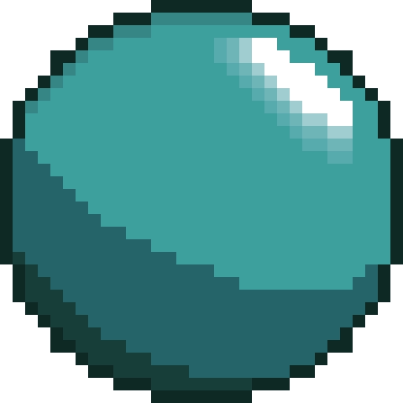
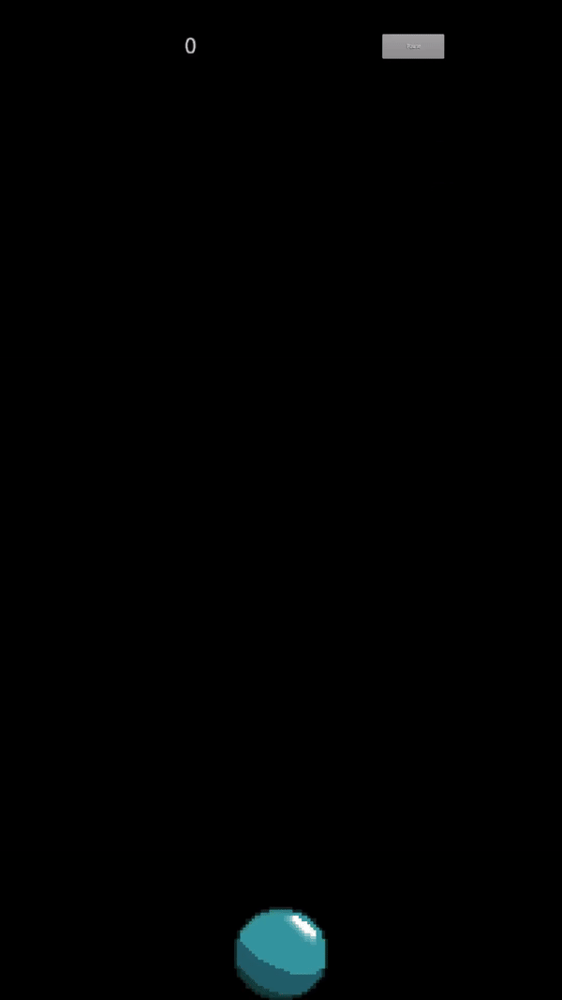

 

<h3 align="center">HoverOrb</h3>

A mobile keepy up game!
 
 

Table of Contents

- [About The Project](#about-the-project)
  - [Built With](#built-with)

## About The Project

 
  

HoverOrb is a mobile game that consists of a ball and the user's touch inputs. The whole point of the game is to maintain the ball airborne for as long as possible. To mimick real world ball movement the direction the ball takes is determined by where the user touches the ball, in the middle makes the ball go straight up, on the right makes the ball go left, and touches on the left makes the ball go right.

### Built With

This project was built with the following technologies:
- 
