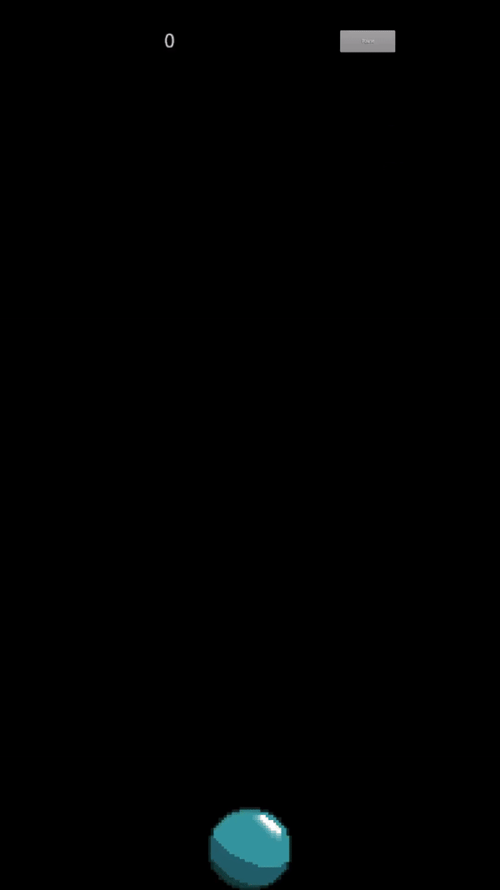

[LinkedIn](https://www.linkedin.com/in/jonathanvillagomezhernandez/) |
[Website](https://www.jonweb.dev/)

<!-- PROJECT LOGO -->
 

  <h1 align="center">HoverOrb</h3>

  

    A mobile keepy up game
  

<!-- TABLE OF CONTENTS -->

  
Table of Contents

  <ol>
    <li>
      <a href="#about-the-project">About The Project</a>
      <ul>
        <li><a href="#built-with">Built With</a></li>
      </ul>
    </li>
    <li><a href="#roadmap">Roadmap</a></li>
  </ol>

<!-- ABOUT THE PROJECT -->
## About The Project

 
  

HoverOrb is a mobile game that consists of a ball and the user's touch inputs. The whole point of the game is to maintain the ball airborne for as long as possible. To mimick real world ball movement the direction the ball takes is determined by where the user touches the ball, in the middle makes the ball go straight up, on the right makes the ball go left, and touches on the left makes the ball go right.

(<a href="#readme-top">back to top</a>)

### Built With

* Java
* libGDX

(<a href="#readme-top">back to top</a>)

<!-- ROADMAP -->
## Roadmap

- [ ] Add more themes
- [ ] Make it pretty
- [ ] Tinker with ball movement to make it challanging enough to be fun
- [ ] Add ball sprite rotation

See the [open issues](https://github.com/othneildrew/Best-README-Template/issues) for a full list of proposed features (and known issues).

(<a href="#readme-top">back to top</a>)

